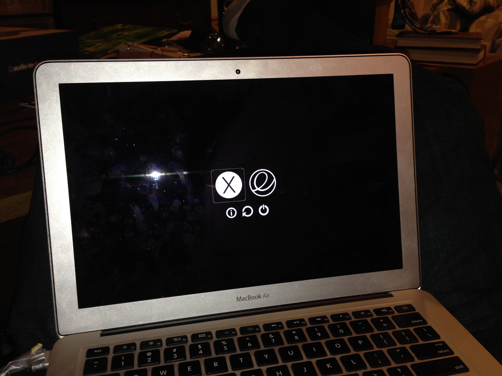

# Installing elementary OS alongside macOS

## Table of Contents

1. [Before We Begin](#before-we-begin)
1. [Tools You'll Need](#tools-youll-need)
1. [Instructions](#instructions)
1. [Theming rEFInd](#theming)
1. [Post-Install](#post-install)
1. [Troubleshooting](#troubleshooting)
1. [Resources](#resources)


## <a id="before-we-begin">Before We Begin</a>

This guide makes a few assumptions about the Mac you're using. Before we you begin, make sure:

### Your Mac only has macOS installed on it.
If you have an existing install of elementary OS or Windows on your computer, this guide may not fully apply to you.

### You're running OS X 10.11 El Capitan or macOS 10.12 Sierra
This guide is written with recent versions of macOS in mind. If you're using an older version, things might be different, so bear that in mind.

### Your Mac is relatively new (2012 or later)
Your Mac must not have a Core 2 duo or Solo (or older) processor. Only the past couple few years of Macs (which have 64-bit EFI) are supported.

### Your Mac is not a 2015/2016 MacBook or 2016 MacBook Pro
At the time of writing (December 2016), these very new models have limited functionality under elementary OS.

## <a id="tools-youll-need">Tools You'll Need</a>

1. At least 15GB of extra disk space on your Mac
1. [elementary OS][elementary] iso
1. [rEFInd][refind] Boot Manager
1. [USB Thumb Drive][flash] at least 2GB capacity
1. Lots of patience!

## <a id="instructions">Instructions</a>

**NOTE**: For those who don't know this, a dollar sign (`$`) indicates that you type the command into a Terminal window. You do not copy the dollar sign :-)

### Prep Your Mac Hard Drive

1. Back your computer up.

1. No, really! Make sure you have a backup, and make sure to test that it works. This procedure has been tested multiple times, but there's still a chance something could go wrong and you could lose data. On macOS, [Time Machine][timemachine] is a great option for backing your computer up.

1. Shrink your macOS partition to make room for elementary OS. At least 30 GB is a reasonable minimum.
  - If you plan on using elementary OS as your primary OS, you'll want to give it much more, of course. Once you decide what size you want to resize your macOS partition down to, you can resize it with this command: `$ diskutil cs resizeStack / XXXg`, where XXX is the desired number of GB your macOS partition will be resized down to.
  - For example, if your Mac has a 500 GB internal hard drive, you might decide to allocate 300 GB for macOS, and 200 GB for elementary OS. You'd then issue this command: `$ diskutil cs resizeStack / 300g`.

### Get elementary OS

1. Download the iso from [elementary OS][elementary].

1. Verify the download by running this command from terminal:

1. ```shasum -a 256 ~/Downloads/elementaryos-0.4-stable-amd64.20160921.iso```

1. Should give you the result `8035e0a2fbc977d931af22dcefb77ed6fe87815d89188a43e2cb345f13e629cf`

1. Create a Bootable USB using [Etcher][etcher]

1. More details on the [elementary OS Install Guide][install-medium]

### Install elementary OS

1. Shut off your Mac and plug in the USB flash drive you created with elementary OS on it.

1. Holding down the **option** key on your keyboard, press the power button to turn on your computer.

1. From the boot manager screen that appears, choose **elementary OS**.

1. After choosing to boot elementary OS, you'll be given a few options as to how to boot the installer. Choose **Try Elementary OS**.

1. Once elementary OS finishes booting up, open **Terminal** and run `$ ubiquity -b`. This will launch the graphical elementary OS installer. When the installer asks about partitioning, make sure you choose **Something Else...**.

    * Note for advanced users: the `-b` flag tells the installer to install *without* installing the GRUB boot-loader. This guide makes use of [EFI stub loading](https://wiki.debian.org/EFIStub), which allows a capable boot manager (such as **rEFInd**, which we'll set up later) to launch the Linux kernel directly, without an intermediary boot-loader (e.g. GRUB).

1. You should see some free space at the end your hard drive partition list (`/dev/sda`), about the size you freed up when you shrunk your macOS partition. Choose this free space, and format it as **Ext4** and set its **mount point** to `/`. Choose **Apply**, and finish installing elementary OS.

### Install reFInd Boot Manager

1. Restart your computer and boot back into macOS. At this point, elementary OS is installed, but you can't boot into it yet, because you haven't installed a boot manager. That's the next step!

1. [Download][refind] the **rEFInd** boot manager and unzip it. Drag the unzipped folder onto your desktop.

1. Turn off your Mac.

1. Boot into Recovery Mode by holding down **⌘ + R** while turning on your Mac.

1. Once in Recovery Mode, open **Disk Utility**. Choose your macOS partition and click **Mount** in the toolbar to mount it.

1. Quit Disk Utility and open **Terminal**.

1. `cd` into the directory where you unzipped rEFInd, which will probably be something like `/Volumes/Macintosh\ HD/Users/jane/Desktop/refind*`, if your macOS username was `jane`.

1. Install rEFInd (`$ ./refind-install`)

1. Reboot your Mac.

1. You should now see the rEFInd menu, which options to boot elementary OS and macOS.  Congrats! You're all set.

## <a id="theming">Theming rEFInd</a>

You can install a [theme][theme] to make it look nicer, and there's many options for customizing rEFInd's behavior too. Here's what my setup looks like:


## <a id="post-install">Post Install</a>

These are **optional** tweaks that will help you feel more are home.

[MacOS Modifier keys ][mac-os-keys] <small>create macOS like keyboard bindings </small>

[f.lux][flux] <small>plugin to help alleviate eye-strain</small>

[bash-it][bashit] <small>make your bash shell awesome</small>

[linux-brew][brew] <small>package manager for linux</small>

## <a id="troubleshooting">Troubleshooting</a>

### My Wi-Fi isn't working

Sometimes Wi-Fi might not work out-of-the-box because the necessary driver isn't installed. In some cases, you'll be able to install them manually.

- *Somehow* get a temporary internet connection, e.g. via your smartphone's USB or Bluetooth tethering function or (*not tested yet!*) a [Thunderbold to RJ45 adapter](http://store.apple.com/us/product/MD463ZM/A/thunderbolt-to-gigabit-ethernet-adapter)
- Run `$ sudo apt install bcmwl-kernel-source` to install the driver and its dependencies.

### It takes ~30 seconds for the rEFInd menu to show up.

This is a known compatibility issue with rEFInd and some Mac hardware models. If you experience this problem, try the following steps:

1. Mount your EFI System Partition (ESP), which is where rEFInd is installed. (`$ sudo ./mountesp`)
1. Rename the refind directory (`$ mv /Volumes/ESP/EFI/refind /Volumes/ESP/EFI/BOOT`)
1. Rename the refind EFI blob (`$ mv /Volumes/ESP/EFI/BOOT/refind_x64.efi /Volumes/ESP/EFI/BOOT/bootx64.efi`)
1. Reboot and see if your problem is fixed.

## <a id="resources">Additional Resources</a>

* [Elementary Swith From Mac Guide][mac-switch-guide]
* [Elementary Basics Guide][basics]
* [Elementary Keyboard Shortcuts ][keyboard-shortcuts]
* [rEFInd Theme][theme]

[refind]: https://sourceforge.net/projects/refind/files/latest/download
[timemachine]: https://support.apple.com/en-us/HT201250
[elementary]: https://elementary.io
[etcher]: https://etcher.io/
[mac-os-keys]: https://elementaryos.stackexchange.com/questions/7889/use-macos-style-modifier-keys
[install-medium]: https://elementary.io/docs/installation#creating-an-installation-medium
[keyboard-shortcuts]: http://lmelinux.net/2014/07/26/elementary-os-keyboard-shortcuts/
[mac-switch-guide]: http://blog.elementary.io/post/152626170946/switching-from-macos-the-basics
[theme]: http://sdbinwiiexe.deviantart.com/art/rEFInd-Next-Theme-407754566
[flash]: https://en.wikipedia.org/wiki/USB_flash_drive
[brew]: http://linuxbrew.sh/
[bashit]: https://github.com/Bash-it/bash-it
[flux]: https://justgetflux.com/linux.html
[basics]: https://elementary.io/docs/learning-the-basics