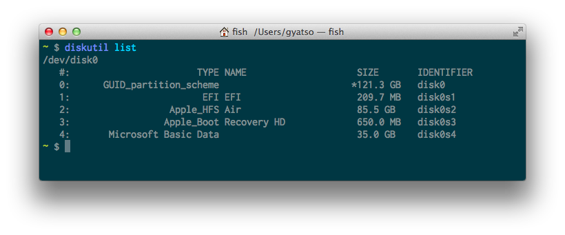

### elementary OS Isis on a Mac

**NOTE**: I'm making a few assumptions about the way your computer is set up. Namely:

#### Your ESP partition is located at disk0s1

1. Download refind http://www.rodsbooks.com/refind/getting.html
2. Run `install.sh --esp`
3. Mount your ESP partition (`mkdir /Volumes/ESP && sudo mount -t msdos /dev/disk0s1 /Volumes/ESP/`)
