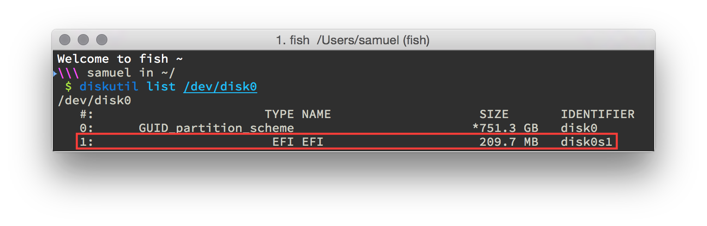
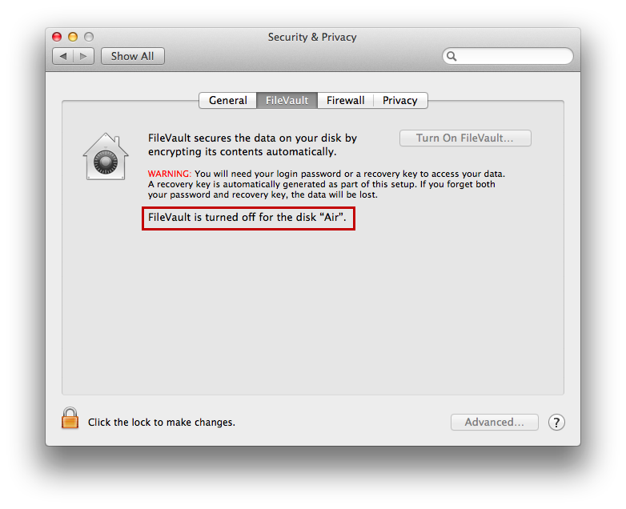

### elementary OS Freya on a Mac (using rEFInd & EFI stub loading)

**NOTE**: I'm making a few assumptions about the way your computer is set up. Namely:

#### I assume your ESP partition is located at disk0s1
(If it's not, make sure you use the proper location. It should be though.)

#### I assume you don't have FileVault2/full disk encryption on
(Actually this *should* work with FDE on, but it's more complicated)

0. Back up all of your files.
0. No really, make sure you have a working backup. This procedure has been tested multiple times, but it's still possible things will go wrong and you could lose data. Time Machine is very good for this on the OS X side.
1. Download rEFInd (http://www.rodsbooks.com/refind/getting.html)
2. Install rEFInd to the ESP partition (`install.sh --esp`)
3. Mount your ESP partition (`mkdir /Volumes/ESP && sudo mount -t msdos /dev/disk0s1 /Volumes/ESP/`)
4. Rename the the refind directory (`mv /Volumes/ESP/EFI/refind /Volumes/ESP/EFI/BOOT`)
5. Rename the refind EFI blob (`mv /Volumes/ESP/EFI/BOOT/refind_x64.efi /Volumes/ESP/EFI/BOOT/bootx64.efi`)
6. Fire up Disk Utility and make a new partition/replace your old Linux install partition with a new partition formatted as FAT. Name it something catchy, like "FREYA" (it'll be overwritten in step #11)
7. Plug your USB drive with elementary OS Freya (If you need to make one, [there is a guide for that here](https://github.com/aroman/freya-on-a-mac/tree/master/iso-to-usb)) into your computer.
8. Pray
9. Reboot and choose the option that indicates that the OS lives on an external/USB disk.
10. Start the installer and when it asks about partitioning, make sure you choose **Something Else...**.
11. Find the partiton you created in step #7 and format that as Ext4 and set its mount point to `/`. **DO NOT** install GRUB — make you set GRUB to install the USB drive. Obviously it's read-only and this will fail, but that's what you want. This setup is completely GRUB free, using rEFInd & EFI-stub loading (the new hotness).
12. Finish installing and restart.
13. Assuming all went well, you should see Ubuntu options in the rEFInd menu. Choose it.
14. You're now dual-booting Freya and OS X. Woot.
15. (optional) Make your rEFInd nicer. You can install a theme, get rid of the duplicate entries, etc. If you want to know how to do that stuff let me know and I'll document it. Here's what my setup looks like:

