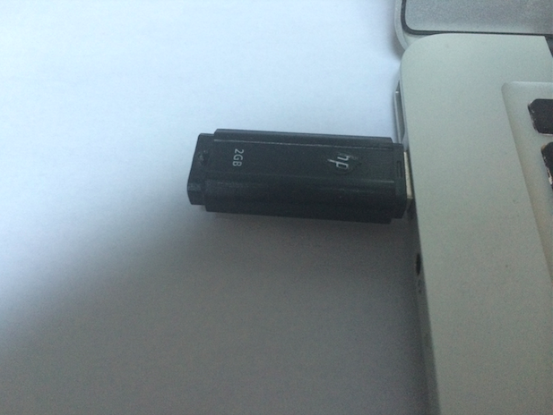
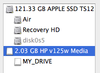
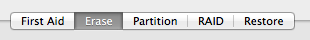
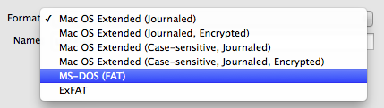
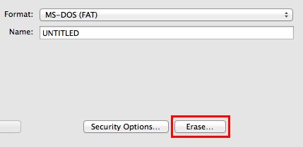
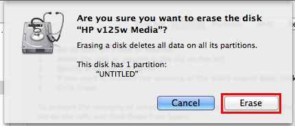
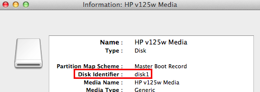

## How to create an elementary OS Freya USB Drive Installer

1. Download the ISO of elementary OS Freya.

2. Open **Disk Utility**.

3. Convert the ISO to DMG format:

  a. In Disk Utility, click **Images** > **Convert...**.
  
  b. Select the ISO and click **Convert**.
  
  c. Set **Image Format** to **read/write**.
  
  d. Click **Save**.
  
4. Insert your >1GB USB drive into your Mac.

  
5. Erase your USB drive:

  a. In Disk Utility's sidebar, select the USB drive.

  

  b. Click on the **Erase** tab.

  

  c. Select **MS-DOS (FAT)** from the **Format** drop-down menu.

  

  d. Click **Erase...**.

  

  e. In the drop-down window, click "Erase".

  

6. Unmount the USB drive:

  a. In Disk Utility's sidebar, select the USB drive.

  
  
  b. Click "Unmount" from the toolbar.
  
7. Determine the mount point of your USB drive:

  a. In Disk Utility's sidebar, select the USB drive.

  
  
  b. Click **File** > **Get Info**.
  
  
  
  c. Confirm that you're looking at the info for your USB drive, and make note of the **Disk Identifier** value.
  
8. Write the Freya disk image to your unmounted USB drive:

  a. Open a Terminal
  
  b. Run `sudo dd if=/path/to/freya.dmg of=/dev/rdiskX bs=1m` (replace `/path/to/freya.dmg` with the actual location of the freya DMG you saved in step 3d and replace the X with the number you wrote down in step 7c)
